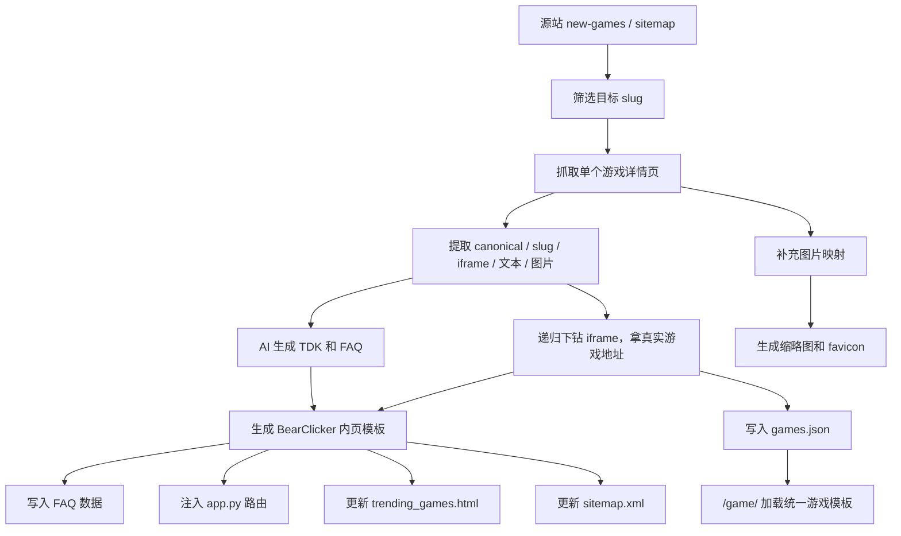

# BearClicker 自动抓取游戏内页逻辑说明

这份文档整理的是当前项目里“自动发现源站游戏页 -> 抓取单个游戏内页 -> 生成 BearClicker 站内页”的真实实现逻辑，目标是让别人可以参考这套思路，快速实现一个类似的系统。

文档基于当前仓库中的实际代码，而不是早期方案稿。当前主线代码主要分布在下面这些文件里：

- `automation/daily_update.py`
- `automation/scraper.py`
- `automation/build_image_map.py`
- `automation/template_generator.py`
- `automation/ai_optimizer.py`
- `api/game_api.py`
- `app.py`

## 1. 这个系统在做什么

系统的目标不是简单“搬运 HTML”，而是把源站上的一个游戏详情页拆成两部分：

- 一部分是 BearClicker 自己的 SEO 内页
- 另一部分是实际可运行的游戏 iframe 地址

最终用户访问的是 BearClicker 的游戏详情页，比如：

- `https://bearclicker.net/some-game`

而详情页里的 Play 按钮会加载：

- `/game/some-game`

这个 `/game/some-game` 再通过本地配置找到真实的游戏地址，把游戏嵌进统一的播放器模板里。

也就是说，当前项目本质上是一个“内容页 + 游戏容器页”双层结构：

1. SEO 内容页负责标题、描述、FAQ、相关推荐、收录。
2. 游戏容器页负责真正加载第三方游戏地址。

## 2. 当前实际使用的两条流程

项目里有两条相似但不完全一样的自动化链路。

### 2.1 旧链路：`automation/main.py`

这条链路的逻辑是：

1. 读取源站 `sitemap.xml`
2. 找出未处理过的页面
3. 抓取页面
4. AI 生成 SEO 文案
5. 生成本地模板和配置
6. 记录到 `automation/processed_games.json`

这条链路更像早期通用版。

### 2.2 现行主链路：`automation/daily_update.py`

这条是现在更偏生产环境的实现，特点是：

1. 先从源站 `/new-games` 找最新游戏
2. 用本地 `static/game-config/games.json` 判断哪些游戏已经发布过
3. 如果当天新游戏不够，就从 `automation/pending_games_list.txt` 补足
4. 抓取详情页
5. AI 生成 TDK 和 FAQ
6. 生成 BearClicker 页面、图片、路由、站点配置
7. 提交 IndexNow
8. 发送飞书日报

如果你朋友要复刻这套系统，建议直接参考这条主链路。

## 3. 系统总流程图



## 4. 自动发现要抓哪些页面

### 4.1 生产逻辑：从 `/new-games` 抓 slug

文件：`automation/daily_update.py`

函数：`get_latest_games_from_source()`

实现方式：

1. 请求 `https://cookie-clicker2.com/new-games`
2. 用 `BeautifulSoup` 解析页面里所有 `<a href="...">`
3. 只保留形如 `/some-slug` 的链接
4. 排除分类页和明显无效页

过滤规则大致是：

- `href` 必须以 `/` 开头
- 不能包含 `games/`
- 不能是 `/all-games`、`/new-games`、`/hot-games`
- 额外排除 `about-us`、`contact-us`、`privacy-policy` 等非游戏页

这里得到的结果只是 slug 列表，不是完整内容。

### 4.2 判断哪些游戏还没发布

函数：`load_processed_games()`

这里不是看 `automation/processed_games.json`，而是直接读取：

- `static/game-config/games.json`

然后把其中每个游戏对象的 `id` 当作“已发布 slug”。

这意味着当前项目里真正代表“线上库存”的是：

- `static/game-config/games.json`

而不是旧链路里的：

- `automation/processed_games.json`

### 4.3 当天目标选择

函数：`get_targets_for_today(target_count=3)`

策略是：

1. 从源站新游列表里挑出“本地没有的 slug”
2. 最多先选 3 个
3. 如果不够，就从 `pending_games_list.txt` 继续补

`pending_games_list.txt` 里的数据也会再过滤一次，避免把分类页塞进去。

## 5. 单个游戏详情页是怎么抓的

文件：`automation/scraper.py`

核心函数：`scrape_game_page(url)`

这个函数负责把一个源站详情页解析成结构化数据。输出字段大致如下：

```json
{
  "url": "https://cookie-clicker2.com/some-game",
  "original_title": "...",
  "original_description": "...",
  "canonical": "https://cookie-clicker2.com/some-game",
  "slug": "some-game",
  "iframe_src": "https://真实游戏地址",
  "image_url": "https://图片地址",
  "favicon_url": "https://图标地址",
  "content_text": "页面正文文本"
}
```

### 5.1 为什么使用 `cloudscraper`

抓取详情页时没有直接用 `requests`，而是用了 `cloudscraper`。

原因很直接：

- 源站有一定 Cloudflare / 反爬保护
- CI 或服务器 IP 更容易被拦
- `cloudscraper` 比纯 `requests` 更稳

所以如果要复刻，建议把“抗反爬请求层”单独封装，而不是写死成普通 HTTP 请求。

### 5.2 详情页提取了哪些信息

#### 1. 原始标题和描述

从页面里提取：

- `<title>`
- `<meta name="description">`

这部分是后面 AI 改写 SEO 文案的原料。

#### 2. canonical 和 slug

优先读：

- `<link rel="canonical">`

再从 canonical 的最后一段路径推导 slug。

这样做比直接从传入 URL 截取更稳，因为部分页面可能有跳转、尾斜杠或异常路径。

#### 3. 页面上的第一层 iframe

抓取页面上的第一个 `<iframe>`，拿到 `src`。

如果是相对路径，会先转成绝对地址。

这个地址通常还不是最终游戏 CDN 地址，所以后面还要继续下钻。

#### 4. OG 图片

优先拿：

- `<meta property="og:image">`

如果是相对路径，也会补成绝对地址。

#### 5. favicon

优先拿页面上的 icon 链接；如果拿不到，就回退到 `image_url`。

#### 6. 正文文本

优先读取：

- `div#description`

如果没有这个节点，就取前 5 个 `<p>` 的文本拼起来。

这部分文本会作为 AI 生成 FAQ 和 SEO 描述的输入。

## 6. 真正关键的部分：递归下钻 iframe

文件：`automation/scraper.py`

核心函数：`get_deep_iframe(url, depth=0, max_depth=3)`

这是整个系统最关键的一步，因为源站详情页里的 iframe 很多时候只是一个中间跳板，并不是真正的游戏资源地址。

### 6.1 为什么要递归

很多游戏站的详情页结构会像这样：

1. 详情页 iframe
2. 中转页 iframe
3. 广告层或供应商包装页 iframe
4. 最终 CDN 游戏页

如果你只取第一层 iframe，最后经常会得到一个不能稳定嵌入的地址。

### 6.2 当前递归规则

逻辑是：

1. 请求当前 URL
2. 找页面里的第一个 iframe
3. 如果没有 iframe，就认为当前 URL 已经是最终页
4. 如果 iframe `src` 是相对路径，先补成绝对路径
5. 如果 `src` 命中已知游戏平台域名，直接返回
6. 否则递归继续向下抓

当前内置的“已知最终宿主”包括：

- `html5.gamemonetize.com`
- `gamedistribution.com`
- `gamesnacks.com`
- `poki.com`
- `crazygames.com`

### 6.3 这一步的意义

最后得到的 `iframe_src` 会被写进：

- `static/game-config/games.json`

后续用户点击 Play 时，BearClicker 的统一游戏模板实际加载的就是这个地址。

换句话说：

- 详情页负责 SEO
- `iframe_src` 负责游戏可玩性

## 7. 图片资源是怎么处理的

当前系统图片来源分两层。

### 7.1 第一层：批量建立图片映射

文件：`automation/build_image_map.py`

这个脚本会请求：

- `https://cookie-clicker2.com/paging.ajax`

按页翻源站列表，把每个 slug 对应的图片 URL 存到：

- `static/data/game_images_map.json`

这样做的原因是，详情页里的 `og:image` 不一定是最好用的图，而列表页经常有更稳定的缩略图。

当前脚本的特点：

1. 通过 AJAX 接口翻页，不走普通列表页翻页
2. 响应可能是“JSON 包裹 HTML 字符串”
3. 优先保留尺寸更大的 `m250x195` 图片

### 7.2 第二层：生成本地缩略图和 favicon

文件：`automation/template_generator.py`

函数：`_process_image_assets(source_url, slug)`

逻辑是：

1. 优先从 `game_images_map.json` 找图片
2. 如果没命中，再回退到详情页抓到的 `image_url`
3. 下载图片到临时目录
4. 生成两套本地资源

输出文件：

- `static/images/games/{slug}.jpg`
- `static/images/favicon/{slug}-favicon.png`
- `static/images/favicon/{slug}-apple-touch-icon.png`

裁切规则：

- 游戏卡片图裁成 4:3，输出 512x384
- favicon 裁成 1:1，输出 180x180

### 7.3 特殊优化

如果最终 `iframe_src` 是 `gamemonetize.com`，系统还会直接尝试构造：

- `https://img.gamemonetize.com/{game_id}/512x384.jpg`

作为更高质量的封面图。

## 8. AI 在这套系统里扮演什么角色

文件：`automation/ai_optimizer.py`

AI 不是负责抓取，而是负责把“抓到的原始文本”变成适合 SEO 页面发布的内容。

当前主要做两件事：

### 8.1 生成 TDK

函数：`optimize_tdk(game_data)`

输出：

- `title`
- `description`
- `keywords`

当前项目里标题格式基本固定成：

- `{Game Name} - Play {Game Name} On Bear Clicker Game`

也就是说，AI 主要发挥在 description 和 keywords 上。

### 8.2 生成 FAQ

函数：`generate_faqs(game_data)`

输出：

- `faqs`
- `conclusion`

这些数据最终会写入：

- `static/data/faqs.json`

页面渲染时再按 slug 读取并展示。

## 9. 站内页是怎么生成的

文件：`automation/template_generator.py`

核心函数：`generate_page(game_data, optimized_tdk, faqs_data)`

它做的事情可以拆成 7 步。

### 9.1 生成本地图片资源

调用 `_process_image_assets()`

产出封面图和 favicon。

### 9.2 把 FAQ 写入 `faqs.json`

数据结构是一个大字典：

```json
{
  "some-game": {
    "faqs": [
      {
        "question": "...",
        "answer": "..."
      }
    ],
    "conclusion": "..."
  }
}
```

运行时，`app.py` 通过 `get_faqs_for_page(page_name)` 按 slug 读取这份文件。

### 9.3 生成 HTML 模板文件

输出路径：

- `templates/{slug}.html`

模板特点：

1. 继承 `base.html`
2. 注入 title / meta description / canonical / og:image
3. Hero 区里的 `game_url` 固定写成 `/game/{slug}`
4. 自动包含：
   - `components/trending_games.html`
   - `components/faq_section.html`

所以这个页面不是直接嵌真实第三方地址，而是把“真正开玩的地址”委托给 `/game/{slug}`。

### 9.4 自动往 `app.py` 注入路由

会插入类似下面的函数：

```python
@app.route('/some-game')
def some_game():
    faq_data = get_faqs_for_page('some-game')
    return render_template('some-game.html',
                         page_title='Some Game',
                         dynamic_faqs=faq_data.get('faqs', []),
                         conclusion=faq_data.get('conclusion', ''),
                         translations=get_translations())
```

这意味着当前项目不是靠“通配详情页路由”渲染，而是每个游戏单独在 `app.py` 里插一个路由函数。

### 9.5 更新 `static/game-config/games.json`

新增一个条目：

```json
{
  "id": "some-game",
  "title": "Some Game",
  "url": "https://真实游戏地址"
}
```

这里的 `url` 优先写入抓到的深层 `iframe_src`。

这份配置是 `/game/<slug>` 真正查找游戏地址的依据。

### 9.6 更新推荐区

往：

- `templates/components/trending_games.html`

里插入一个新卡片，让这个游戏出现在站内推荐区。

### 9.7 更新 sitemap

往：

- `static/sitemap.xml`

追加新 URL，并尝试 ping Google。

## 10. `/game/<slug>` 是怎么把游戏跑起来的

详情页里点击 Play 后，前端走的是：

- `/game/{slug}`

对应路由在：

- `app.py`

实际处理函数在：

- `api/game_api.py`

逻辑是：

1. 读取 `static/game-config/games.json`
2. 找到 `id == slug` 的配置项
3. 读取 `static/game-templates/game-template.html`
4. 替换模板里的占位符：
   - `{{GAME_TITLE}}`
   - `{{GAME_URL}}`
   - `{{DOMAIN_DISPLAY}}`
   - `{{DOMAIN_LINK}}`
5. 返回最终 HTML

所以复刻时，你可以把系统拆成两个独立模块：

- 内容发布模块：生产 SEO 页
- 游戏容器模块：统一承载第三方 iframe

这样会比“每个游戏都生成一整套播放页 HTML”更省维护成本。

## 11. 当前系统里几个很重要的隐藏约定

如果你朋友要照着做，下面这些点最好提前知道。

### 11.1 真正的“已发布集合”是 `games.json`

在 `daily_update.py` 里，判断是否已发布是读：

- `static/game-config/games.json`

不是读：

- `automation/processed_games.json`

所以如果别人复刻，最好明确区分：

- 已抓取
- 已生成
- 已上线

当前项目把“已上线”直接绑定到了 `games.json`。

### 11.2 `main.py` 和 `daily_update.py` 有轻微分叉

`main.py` 会在成功后写 `processed_games.json`，而 `daily_update.py` 不写这个文件。

说明这个仓库里存在“旧流程”和“新流程”并存的情况。复刻时建议只保留一条主流程，不要双轨并行。

### 11.3 slug 有过 `.com` 污染问题

在 `daily_update.py` 和 `reprocess_games.py` 里都专门修过这个问题：

- 如果 slug 以 `.com` 结尾，就截掉

说明源站某些页面的 canonical 或路径数据并不总是干净。

### 11.4 路由注入方式比较脆弱

当前是直接改 `app.py` 文本，把新的 route snippet 插进去。

这在小项目里够用，但在大项目里有几个风险：

- `app.py` 会越来越长
- 自动插入容易和人工修改冲突
- 很难做结构化回滚

如果要重做，建议改成“一个动态详情页路由 + slug 查模板/配置”的方式。

### 11.5 深层 iframe 抓取目前只递归 3 层

这个深度是经验值，不是绝对正确值。

如果源站链路更复杂，可能还需要：

- 更深递归
- 跳转跟踪
- JS 渲染
- Playwright 兜底

### 11.6 图片映射脚本依赖源站 AJAX 结构

`build_image_map.py` 假设 `paging.ajax` 可用，而且返回结构比较固定。

如果换源站，这一层通常最容易失效，最好把“列表抓图逻辑”抽成单独适配器。

## 12. 如果要做一个类似系统，推荐这样拆模块

### 12.1 最小可用版

至少要有 5 个模块：

1. `source_discovery`
   - 负责发现新 slug
2. `page_scraper`
   - 负责抓详情页结构化数据
3. `iframe_resolver`
   - 负责递归找到真实游戏地址
4. `publisher`
   - 负责生成内容页和本地配置
5. `player_gateway`
   - 负责统一渲染 `/game/<slug>`

### 12.2 建议的数据表或数据文件

如果不想像当前项目一样全靠 JSON 文件，推荐至少维护下面几类状态：

- `source_games`
  - 源站发现到的 slug 和原始 URL
- `scraped_games`
  - 抓取结果和原始字段
- `published_games`
  - 已发布到目标站的 slug、发布时间、目标 URL
- `asset_jobs`
  - 图片下载与裁切状态

### 12.3 推荐的发布顺序

建议始终按这个顺序：

1. 先抓取并校验 `iframe_src`
2. 再生成内容和图片
3. 再写路由和站点配置
4. 最后提交 sitemap / 推送收录

这样即使中间失败，也比较容易恢复。

## 13. 按当前项目抽象出来的伪代码

```python
def run():
    refresh_image_map()

    target_slugs = choose_targets()
    for slug in target_slugs:
        page_url = f"https://source-site.com/{slug}"

        raw = scrape_game_page(page_url)
        if not raw or not raw["iframe_src"]:
            continue

        seo = optimize_tdk(raw)
        faqs = generate_faqs(raw)

        page_data = {
            **raw,
            **seo,
            "faqs": faqs["faqs"],
            "conclusion": faqs["conclusion"],
        }

        generate_local_assets(page_data)
        write_faq_json(page_data)
        write_detail_template(page_data)
        register_detail_route(page_data["slug"])
        register_game_player(page_data["slug"], page_data["iframe_src"])
        append_trending(page_data["slug"])
        append_sitemap(page_data["slug"])

    notify_indexing()
    notify_report()
```

## 14. 一句话总结这套系统

这套系统的核心不是“抓网页”，而是：

- 先找到源站新增游戏
- 再从详情页里提取 slug、文本和真实游戏地址
- 最后把“SEO 内容页”和“统一游戏容器页”拼成一个可持续扩展的发布系统

如果你朋友要复刻，最值得保留的设计有两个：

1. 把 SEO 页面和真实游戏加载页分离。
2. 把 iframe 深层解析做成独立模块，而不是只取第一层 iframe。

如果以后你愿意，我还可以继续把这份文档再整理成一版“更偏架构设计/可直接照着开发”的版本，比如补上模块边界、数据库表设计、任务队列和失败重试方案。
